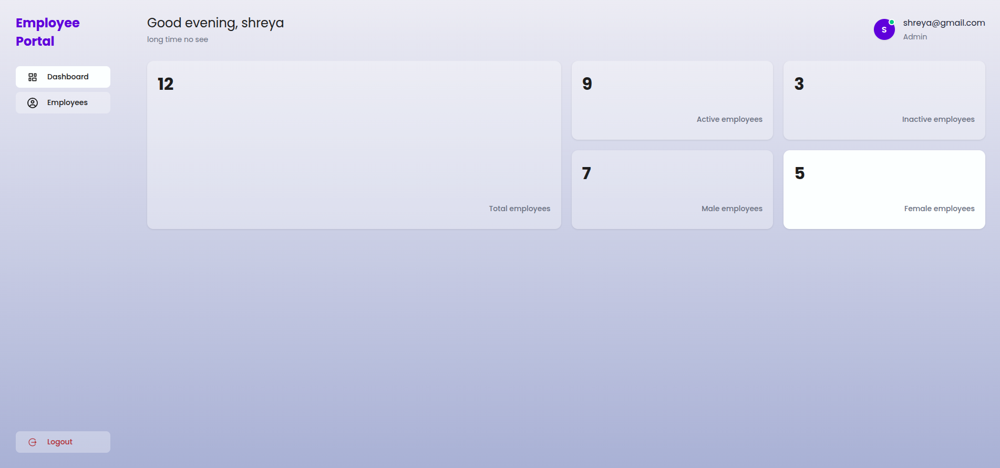
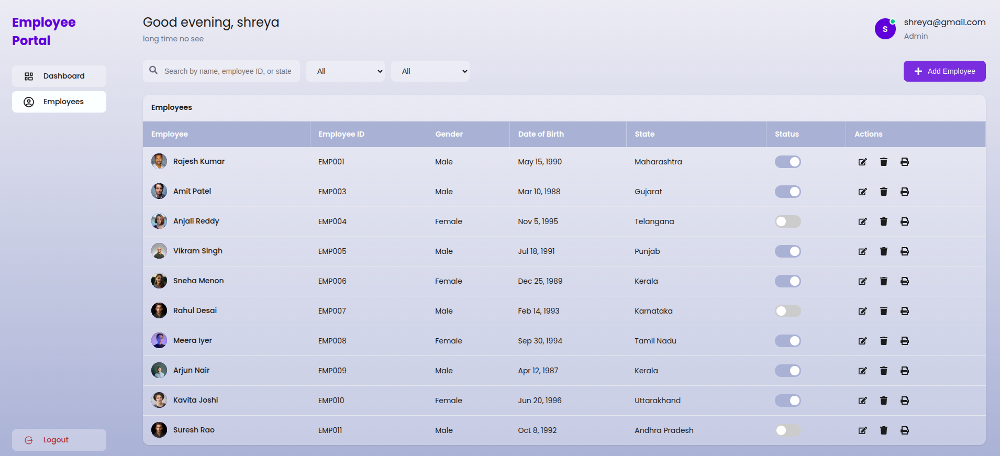

## Overview
Employee Management Dashboard built with React.

## Features
- Authentication
- CRUD operations
- Image upload
- Search & filter
- Print support

## Tech Stack
- ReactJs
- React Router
- LocalStorage

## Run Locally
- used node version 22
- npm install
- npm run dev

## Assumptions
- Mock authentication
- Local Storage used as data source

## Design & Styling
- Fonts: Google Fonts (Poppins)
- Icons: React Icons (various)